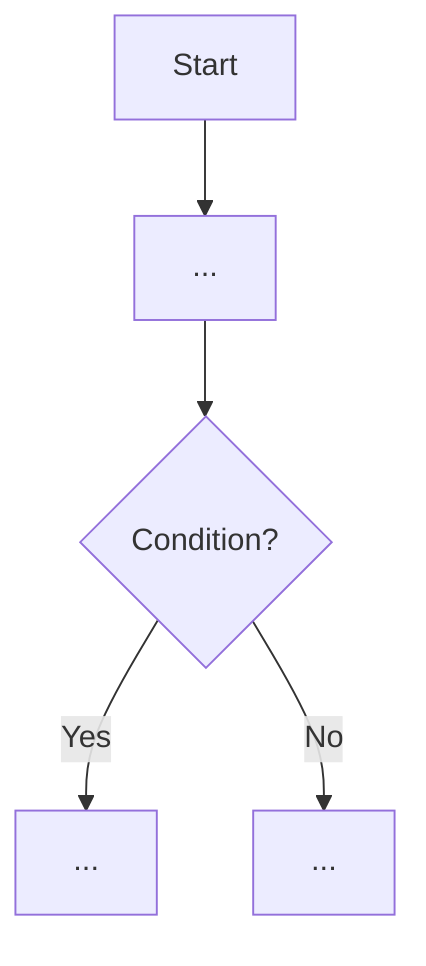
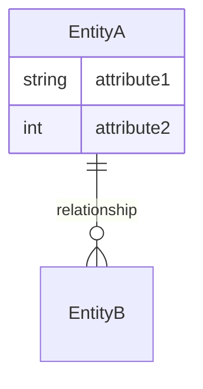
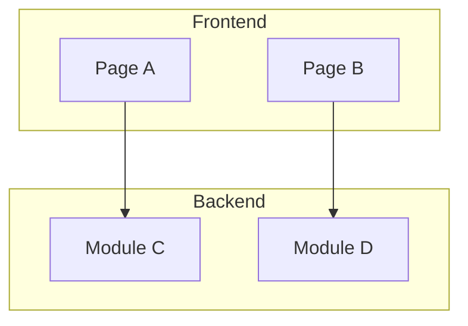
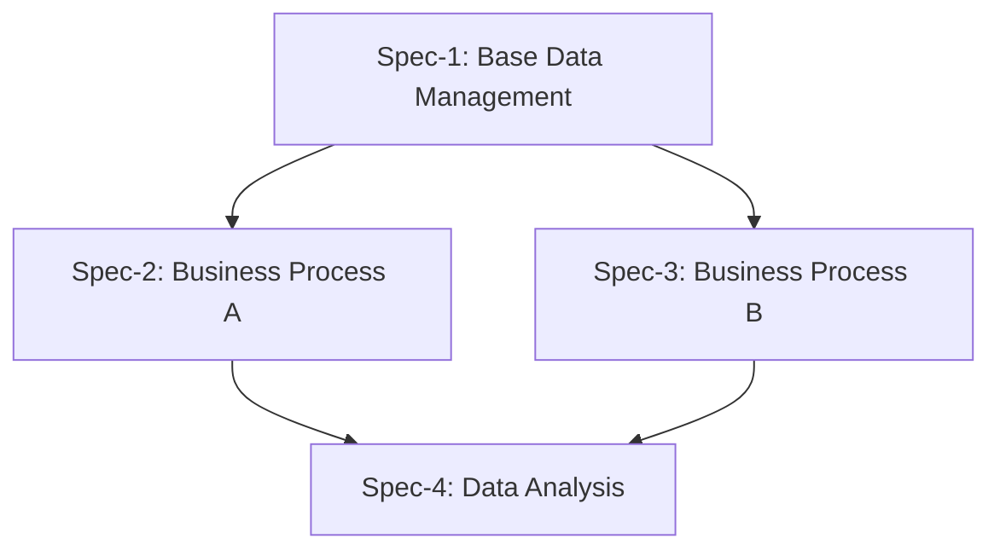

## User Input

```text
$ARGUMENTS
```

You **MUST** consider the user input before proceeding (if not empty).

## Overview

`/speckit.discovery` is the **first step** in requirements engineering, positioned between Product Requirements Document (PRD) and detailed specifications (spec.md).

**Core Objectives**:

1. Understand requirement holistically from **business logic perspective**
2. Identify core business processes, domain models, and system views
3. Provide **clear, evidence-based** requirement decomposition plans
4. Guide subsequent `/speckit.specify` with decomposition strategy

**Key Positioning**:

- ❌ Not business analysis (doesn't focus on ROI, market value, user personas)
- ❌ Not product planning (doesn't focus on long-term roadmap, version iterations)
- ❌ Not technical implementation (doesn't focus on programming languages, specific frameworks, code details)
- ✅ Is **business logic analysis** (focuses on how business operates, how processes flow)
- ✅ Is **domain modeling** (focuses on core entities, business rules, state transitions)
- ✅ Is **system structure design** (focuses on module division, interface definition, architecture approach)
- ✅ Is **decomposition guidance** (focuses on how to reasonably split requirements, reduce coupling)

**Role Perspective**: System Architect / Technical Lead / Business Architect / Domain Expert

## Execution Flow

### 1. Initialization and Context Loading

1. **Parse user's raw requirement**:

   - Extract complete requirement description from `$ARGUMENTS`
   - If description is incomplete, ask up to 3 key clarification questions

2. **Check for existing related documents**:

   - Check if Product Requirements Document (PRD) exists
   - Check if related architecture documents exist
   - If they exist, load relevant context for consistency

3. **Determine output path**:
   - Create unique identifier for this requirement (format: `NNN-requirement-keywords`)
   - Create directory structure: `specs/NNN-requirement-keywords/`
   - Output file: `specs/NNN-requirement-keywords/discovery.md`

### 2. Holistic Requirement Analysis

Analyze following structure using `.specify/templates/discovery-template.md` as template:

#### 2.1 Requirement Overview (Concise but Complete)

- **Background**: Explain requirement source and background in 2-3 sentences
- **Core Problem**: What problem to solve? (1 sentence)
- **Expected Outcome**: What state to achieve after completion? (1-2 sentences)
- **Scope Boundaries**: Clearly define what's in scope and out of scope

#### 2.2 Business Process Analysis ⭐Core

- **Main Process Diagram**: Draw complete end-to-end business process
- **Key Nodes**: Mark important decision points, state transition points
- **Role Interactions**: What roles involved and how they interact
- **Exception Processes**: Identify main exception scenarios
- **Integration Points**: Integration points with external systems

**Output Format**:



#### 2.3 Domain Model Analysis ⭐Core

- **Core Entities**: Identify 5-10 core entities
- **Entity Relationships**: Relationships between entities (1:1, 1:N, N:N)
- **Key Attributes**: 3-5 core attributes for each entity
- **State Model**: For entities with state transitions, draw state machine diagram
- **Data Scale**: Estimate data scale for each entity

**Output Format**:



#### 2.4 System View ⭐Core

- **Page/Module List**: List involved pages or functional modules
- **Module Responsibilities**: Core responsibilities of each module (1 sentence)
- **Module Interactions**: Call relationships between modules
- **Technical Boundaries**: Frontend/Backend/Database responsibility division
- **External Integrations**: External systems that need integration

**Output Format**:



#### 2.5 Architecture Approach ⭐Core

- **Overall Architecture Plan**: What architecture pattern (layered, microservices, event-driven, etc.)
- **Layered Design**: Responsibility division across application, service, and data layers
- **Key Technical Decisions**:
  - Data storage solution
  - State management solution
  - Concurrency handling solution
  - Security solution
- **Performance Considerations**: Anticipated performance bottlenecks and optimization points
- **Extensibility**: Possible future extension points

#### 2.6 Technical Constraints and Dependencies

- **Existing System Constraints**: Must be compatible with existing systems
- **Technology Stack Limitations**: Must use technology stacks
- **Performance Requirements**: Clear performance metrics (response time, throughput, etc.)
- **Security Requirements**: Permission control, data encryption, etc.
- **External Dependencies**: Dependent third-party services or APIs

### 3. Requirement Decomposition Plan ⭐User's Core Need

This is the **most important output** of discovery phase. Based on above analysis, provide clear decomposition plan.

#### 3.1 Decomposition Principles (Technical Perspective)

**Principle 1: Business Boundary Clarity**

- ✅ Each Spec should correspond to a **complete business loop**
- ✅ High cohesion within Spec, low coupling between Specs
- ❌ Avoid splitting one business process into multiple Specs

**Principle 2: Domain Model Integrity**

- ✅ Related entities should be in same Spec
- ✅ CRUD operations of an entity should be in same Spec
- ❌ Avoid scattering operations of one entity across multiple Specs

**Principle 3: Technical Independence**

- ✅ Each Spec should be independently designable, developable, testable
- ✅ Specs interact through clear interfaces
- ❌ Avoid strong coupling dependencies between Specs

**Principle 4: Value Deliverability**

- ✅ Each Spec should deliver **independent business value** after completion
- ✅ High-priority Specs should be deliverable first
- ❌ Avoid requiring multiple Specs to be completed simultaneously for use

**Principle 5: Appropriate Size**

- ✅ Single Spec should be **2-4 weeks of development effort**
- ✅ Overly large requirements should be split, overly small ones merged
- ❌ Avoid Specs too large (>8 weeks) or too small (<3 days)

**Principle 6: Dependency Minimization**

- ✅ Prioritize splitting out Specs with **no dependencies or few dependencies**
- ✅ When there are dependencies, they should be **unidirectional**
- ❌ Avoid circular dependencies

#### 3.2 Decomposition Methodologies

**Method 1: Split by Business Process** (Recommended)

- Identify main processes and sub-processes
- Each process or process combination becomes a Spec
- Example: Order Management → Spec1: Order Creation, Spec2: Order Execution, Spec3: Order Settlement

**Method 2: Split by Domain Entity**

- Identify core entity groups
- Each entity group and its operations become a Spec
- Example: Inventory Management → Spec1: Inbound Management, Spec2: Outbound Management, Spec3: Inventory Count

**Method 3: Split by User Role**

- Identify main user roles
- Complete functionality for each role becomes a Spec
- Example: Production Management → Spec1: Planner Workspace, Spec2: Shop Supervisor Workspace, Spec3: Operator Workspace

**Method 4: Split by Technical Layer** (Use with Caution)

- Separate basic functionality from advanced functionality
- Example: Spec1: Basic CRUD, Spec2: Advanced Query, Spec3: Data Analysis

**Method 5: Split by Priority in Batches** (Combine with Other Methods)

- MVP (Minimum Viable Product) → First batch of Specs
- Important features → Second batch of Specs
- Enhancement features → Third batch of Specs

#### 3.3 Decomposition Plan Output

Output following information for each proposed Spec:

```markdown
### Spec-1: [Spec Name]

**Priority**: P1/P2/P3
**Estimated Effort**: X weeks
**Decomposition Basis**: [Explain which method and principle used]

**Scope Description**:

- Included business processes: [...]
- Included core entities: [...]
- Included pages/modules: [...]
- Involved roles: [...]

**Atomicity Verification**:

- ✅ Independently implementable: [Explain why]
- ✅ Independently testable: [Explain test scenarios]
- ✅ Independently deliverable: [Explain delivered value]

**Boundary Description**:

- Included: [What's explicitly included]
- Not included: [What's explicitly not included]
- Interfaces with other Specs: [How to interact]

**Dependencies**:

- Prerequisite dependencies: [What Specs or existing features this depends on]
- Downstream dependencies: [What Specs depend on this Spec]
```

**Decomposition Relationship Diagram**:



#### 3.4 Implementation Recommendations

- **Phase 1**: Recommend prioritizing [Spec list], rationale: [...]
- **Phase 2**: Recommend implementing [Spec list], rationale: [...]
- **Risk Points**: Identified major technical risks and mitigation plans
- **Next Actions**: For each Spec, execute `/speckit.specify [Spec name]`

### 4. Document Generation and Validation

1. **Generate discovery.md using template**:

   - Based on `.specify/templates/discovery-template.md`
   - Fill in all analysis results
   - Ensure all diagrams render correctly

2. **Self-validation checklist**:

   - [ ] Are business processes complete and clear?
   - [ ] Does domain model cover core entities?
   - [ ] Does system view show main modules?
   - [ ] Does decomposition plan follow 6 principles?
   - [ ] Is each Spec's scope clear and unambiguous?
   - [ ] Are dependencies between Specs clear?
   - [ ] Are there circular dependencies? (Should be none)
   - [ ] Is each Spec's effort within 2-4 weeks?

3. **Save document**:
   - Save to `specs/NNN-requirement-keywords/discovery.md`
   - If there are images, save to `specs/NNN-requirement-keywords/images/`

### 5. Output Report

After completion, output to user:

```markdown
✅ Holistic requirement analysis complete!

📁 **Output Document**: `specs/[NNN-requirement-name]/discovery.md`

📊 **Analysis Summary**:

- Core entities identified: X
- Core processes identified: X
- Core modules identified: X

🔀 **Decomposition Plan**:

- Recommend splitting into X Specs
- Phase 1: [Spec list]
- Estimated total effort: X weeks

📋 **Next Actions**:

1. Review decomposition plan, confirm if reasonable
2. For each Spec, execute: `/speckit.specify [Spec name]`
3. Recommend executing in priority order, complete high-priority Specs first

⚠️ **Notes**:

- [If there are circular dependencies, remind]
- [If there are high-risk technical points, remind]
```

## Key Rules

1. **Focus on Business Logic Analysis**:

   - ✅ Focus on "how business operates", "how processes flow"
   - ✅ Focus on "how to design system", "how to divide modules"
   - ❌ Don't focus on "why it makes money", "whether market accepts"
   - ❌ Don't focus on "what language to use", "which framework to choose"

2. **Holistic Thinking**:

   - See the big picture first, then details
   - Understand complete context of requirement
   - Identify hidden dependencies and relationships

3. **Evidence-Based Decomposition**:

   - Every decomposition decision must explain rationale
   - Follow 6 decomposition principles
   - Verifiable and traceable

4. **Diagrams Over Text**:

   - Must provide process diagrams, domain model diagrams, architecture diagrams
   - Diagrams should be clear, accurate, and easy to understand

5. **Pragmatic Not Perfect**:

   - Don't pursue 100% completeness
   - Focus on 20% core delivering 80% value
   - Allow subsequent adjustments and refinements

6. **Align with SOLID Principles**:
   - Single Responsibility: Each Spec has single responsibility
   - Open-Closed: Specs extensible without modification
   - Interface Segregation: Clear interfaces between Specs
   - Dependency Inversion: Depend on abstract interfaces not implementation

## Interaction Mode

1. **If requirement description unclear**:

   - Ask 3-5 clarification questions
   - Questions should be closed-ended or multiple choice
   - Don't block process, can continue based on assumptions

2. **If decomposition plan uncertain**:

   - Provide 2-3 alternative plans
   - Explain pros and cons of each plan
   - Recommend optimal plan with rationale

3. **If technical risks discovered**:
   - Clearly mark risk points
   - Provide mitigation measure recommendations
   - Don't hide problems

## Relationship with Other Commands

```
Raw Requirement
    ↓
/speckit.discovery  ← [This Command] Holistic analysis and decomposition
    ↓ Produces discovery.md
    ↓ Gets decomposition plan for N Specs
    ↓
/speckit.specify [Spec-1]  ← Refine first Spec
    ↓ Produces specs/NNN-requirement/001-spec-1/spec.md
    ↓
/speckit.specify [Spec-2]  ← Refine second Spec
    ↓ Produces specs/NNN-requirement/002-spec-2/spec.md
    ↓
/speckit.clarify [Spec-1]  ← Clarify first Spec
    ↓
/speckit.plan [Spec-1]     ← Plan first Spec
    ↓
/speckit.tasks [Spec-1]    ← Generate tasks
    ↓
/speckit.implement [Spec-1] ← Implement
```

## Quality Standards

A high-quality discovery.md should meet:

1. **Completeness**: Covers all necessary analysis dimensions (business processes, domain models, system views, decomposition plan)
2. **Clarity**: Implementation team can quickly understand business logic holistically and system structure
3. **Actionability**: Decomposition plan can directly guide subsequent detailed design and development work
4. **Consistency**: Aligns with existing architecture documents and business rules
5. **Verifiability**: Every decomposition decision has clear rationale and traceable reasoning

## Notes

1. **Avoid Over-Design**: Discovery is analysis not detailed design
2. **Avoid Premature Optimization**: Focus on architecture approach, don't nitpick implementation details
3. **Avoid Too Many Assumptions**: Clarify promptly when unclear
4. **Avoid Over-Decomposition**: Specs are not tasks, should maintain appropriate granularity
5. **Avoid Circular Dependencies**: If discovered, readjust decomposition plan

## Example Reference

See detailed example: `specs/000-example/discovery.md` (if exists)

---

**Usage Tips**:

- For simple requirements (<1 week effort), can skip discovery and use `/speckit.specify` directly
- For complex requirements (>4 weeks effort), strongly recommend executing `/speckit.discovery` first
- Decomposition plan from discovery is not final, can be adjusted during implementation
